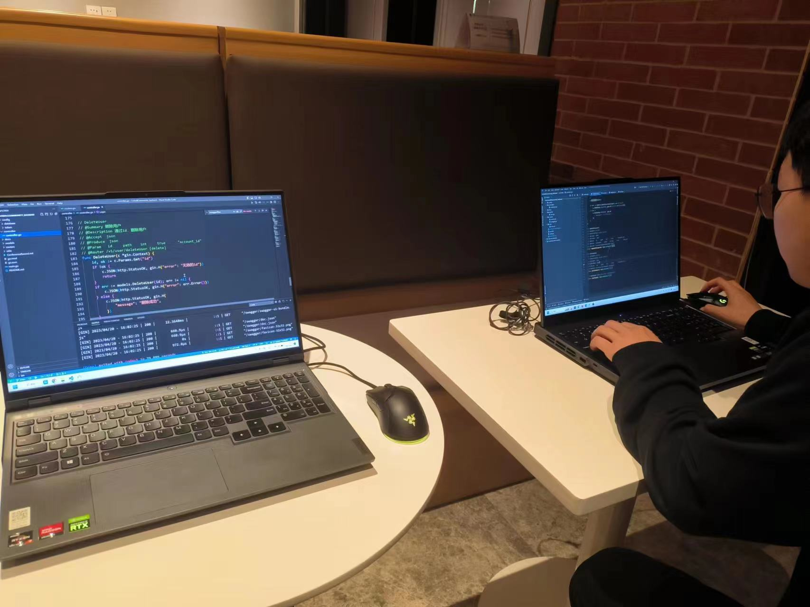

# 会议记录及工作汇总

### first meeting in April 8th

第一次讨论确定了项目选题，前后端开发语言及开发框架，明确了项目大概需要实现的功能，决定优先搭建项目框架，安排邱童负责后端框架建立，汪毕强负责在初步框架上统筹优化项目结构，并在云服务器上搭建数据库，完成用户模块的初步建表任务。

### second meeting in April 21st

初步明确功能模块及业务功能细节，完成数据库表设计，包括user、pet、order、ordercomment、blog、blogcomment等。开始全面构建后端数据库表和接口。

### Third meeting in June 1st

优化已知的数据库表存在的问题，明确接下来的工作方向主要是：1. 完善接口文档设计方法；2. 通过redis实现数据持久化，为地图组件提供基本的开发条件；3. 进一步开发后端的模块； 4. 搭建前端的大致开发框架。

### Fourth meeting in June 12th

讨论中完成了以下工作：统一接口文档设计方法，搭建前端开发框架并建库；明确接下来的工作方向是：1. 开发订单模块的接口；2. 开发后端中token验证的redis缓存；3. 开发前端基础模块。

## 工作汇总

4.11 项目初始化：完成前后端建库，后端搭建了基础的登录注册模块。

4.15 优化项目架构，补充项目文档。将mysql和token等项目配置结构集成到一个模块中，并将原本的error模块拓展为utils模块，使其不仅可以定义错误类型，也能实现定义返回结构等。此外，补充项目文档，介绍了项目结构安排，以及大致的开发规划。

4.15 优化数据库连接，取消自动表构建操作，完成数据库部署。

4.17 初步配置swagger接口文档，拟修改用户表结构。

4.20 完善swagger接口文档配置，实现接口可视化。

4.21 完成数据库表设计。

5.9 增加手机发送验证码功能。

6.2 定义项目中接口文档设计规范，完善用户模块接口文档，验证用户模块接口文档全部可用。

6.3 提出重要需求：user模块中account和username功能重叠，应当合并。  主要工作：初步建立pet宠物模块，调整user模块中id项，数据库表调整

6.10 实现基于redis的数据持久化。

6.11 实现验证码登录功能，加入跨域中间件，实现上传文件功能。

6.12 完成宠物模块接口的第一次迭代开发，初步实现地理位置的redis缓存机制。

6.15 完成订单模块接口的第一次迭代开发，完善数据库表实现中外键的设置和界定，关联pet和order表。更新接口文档